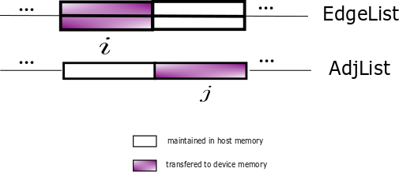

[](https://travis-ci.com/zhaofeng-shu33/triangle_counting_gpu)
[](https://codecov.io/gh/zhaofeng-shu33/triangle_counting_gpu)
[](https://triangle-counting-gpu.readthedocs.io/en/latest/?badge=latest)

Triangles Counting in CUDA GPU
=========
Important Notice: the implementation in this repo is not faster than [this one](https://github.com/zhaofeng-shu33/triangle_counting_gpu_v2).

CUDA implementation of parallel algorithm for counting triangles in undirected graphs.

## How to build
use CMake to generate the build recipe.

## How to use
```
nvtc-variant -f input.bin
```
## CI
Since cloud provider does not have Nvidia toolkit and device on their runner, we use private CI server to build for each commit.
Our server (Linux Cluster powered by Bright Computing) uses slurm as workload manager to submit jobs to computing nodes equipped with GPU devices while the 
compilation is done on manage node. The configuration file is `.gitlab-ci.yml`.

## Related repository
* [triangle counting in cpu](https://github.com/zhaofeng-shu33/triangle_counting)
* [triangle counting in gpu](https://github.com/adampolak/triangles)
* [triangle counting benchmark](https://github.com/zhaofeng-shu33/triangle_counting_benchmark)

## Method used in detail
We use CSR sparse matrix format to save the graph in CPU memory.
### CSR format storage
Suppose our graph has m edges and n nodes.
Two arrays are required, (n+1) length array
(row array) and (m) length array storing node index. We only store upper triangular matrix.

For example, suppose our graph has (0,1),(1,2),(1,3),(2,3),(2,4),(3,4),(3,5),(4,5).
n=6,m=8.
Storing in CSR Lower Triangular Format is equivalent to:
`[0,1,1,2,2,3,3,4]`(m) and `[0,0,1,2,4,6,8]`(n+1).

```Python
from scipy import sparse
a = sparse.csr_matrix(([1]*8, [0,1,1,2,2,3,3,4], [0,0,1,2,4,6,8]), shape=(6,6))
print(a)
```

```shell
  (1, 0)        1
  (2, 1)        1
  (3, 1)        1
  (3, 2)        1
  (4, 2)        1
  (4, 3)        1
  (5, 3)        1
  (5, 4)        1
>>> print(a.todense())
[[0 0 0 0 0 0]
 [1 0 0 0 0 0]
 [0 1 0 0 0 0]
 [0 1 1 0 0 0]
 [0 0 1 1 0 0]
 [0 0 0 1 1 0]]
```

### Data exchange between Host and Device Memory


For very large graphs, device memory is limited and is unable to store the data of the whole graph.
To use GPU in such case. We maintain the whole graph in host memory and transfers partial data to device memory for computational purpose. To achieve this purpose, two arrays are needed and their partial contents are copied to device memory.

EdgeList contains all edge pairs and AdjList concatenates adjacency node index of each node to a single array. To maintain this single array, an extra offset array is needed. This offset array is global and can be put into GPU device memory. We use `(i, j)` pair to represent the part to be transfered to device memory at each step and each number should iterate from 1 to the total split number.

Actually, the illustrative structure in the above picture is redundant and can be expressed efficiently in CSR format. 
